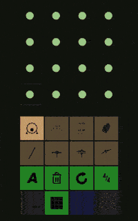

DRUM ON
=======

.. image:: https://travis-ci.org/tube42/drumon.svg
    :target: https://travis-ci.org/tube42/drumon

This is a FOSS drum app for Android.

.. raw:: html

   

Building
--------

To run this app, you will need Java and Android SDKs.

To build the project and run on desktop

.. code:: shell

    ./gradlew desktop:run

To build for android and upload it to your device

.. code:: shell

    ./gradlew installDebug

Assets
------

Asset sources are found under the extra folder. To compile assets you will need the following tools:

1. "sox" for converting samples
2. ImageMagic for converting PNG images
3. Inkscape for rendering SVG files

That is,

.. code:: shell

    sudo apt-get install sox imagemagick inkscape
    make setup

To build the assets, you should do

.. code:: shell

    make
